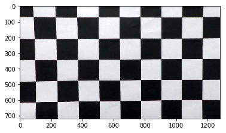
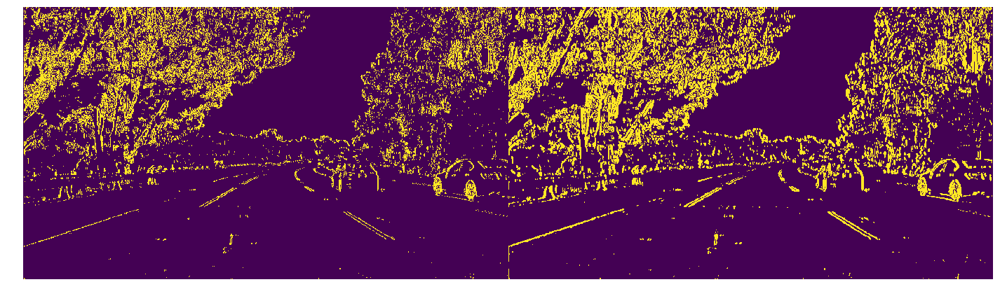
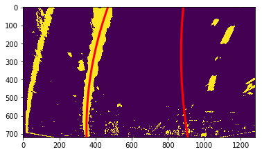

```python
import numpy as np
import cv2
import glob
import matplotlib.pyplot as plt
import pickle

from moviepy.editor import VideoFileClip
from IPython.display import HTML

from nb_utils import *

%matplotlib inline

```

# Calibrating the camera
First I used the chessboard images to get calibration coefficients to be used later
After converting to grayscale, the chessboard corners are found. If this is successful they are added to a list of image points. The image points and object points are passed to the calibrateCamera method, which returns the calibration matrices.


```python
img = cv2.imread('camera_cal/calibration1.jpg')
gray = cv2.cvtColor(img, cv2.COLOR_BGR2GRAY)
```


```python
ret, corners = cv2.findChessboardCorners(gray, (9,5), None)
print(ret)
img_corners = cv2.drawChessboardCorners(img, (9,5), corners, ret)
plt.imshow(img_corners)

```

    True


    <matplotlib.image.AxesImage at 0x7fa98c55def0>


```python
# prepare object points, like (0,0,0), (1,0,0), (2,0,0) ....,(6,5,0)
objp = np.zeros((6*9,3), np.float32)
objp[:,:2] = np.mgrid[0:9,0:6].T.reshape(-1,2)

objpoints = [] # 3d points in real world space
imgpoints = [] # 2d points in image plane.

images = glob.glob('camera_cal/calibration*.jpg')

for fname in images:
    img = cv2.imread(fname)
    gray = cv2.cvtColor(img,cv2.COLOR_BGR2GRAY)
    ret, corners = cv2.findChessboardCorners(gray, (9,6), None)
    if ret == True:
        print(fname)
        objpoints.append(objp)
        imgpoints.append(corners)

```

    camera_cal/calibration6.jpg
    camera_cal/calibration7.jpg
    camera_cal/calibration3.jpg
    camera_cal/calibration2.jpg
    camera_cal/calibration20.jpg
    camera_cal/calibration19.jpg
    camera_cal/calibration18.jpg
    camera_cal/calibration15.jpg
    camera_cal/calibration14.jpg
    camera_cal/calibration16.jpg
    camera_cal/calibration17.jpg
    camera_cal/calibration13.jpg
    camera_cal/calibration12.jpg
    camera_cal/calibration10.jpg
    camera_cal/calibration11.jpg
    camera_cal/calibration9.jpg
    camera_cal/calibration8.jpg


```python
ret, mtx, dist, rvecs, tvecs = cv2.calibrateCamera(objpoints, imgpoints, gray.shape[::-1], None, None)
```


```python
with open('distortion_values.pickle', 'wb') as f:
    pickle.dump((ret, mtx, dist, rvecs, tvecs), f)
```


```python
with open('distortion_values.pickle', 'rb') as f:
    ret, mtx, dist, rvecs, tvecs = pickle.load(f)
```


```python
img1 = cv2.imread('camera_cal/calibration1.jpg')
dst1 = cv2.undistort(img1, mtx, dist, None, mtx)
```

# Correcting for distortion
Below is an example of the original and undistorted (corrected) image


```python
plt.imshow(img1)
```


    <matplotlib.image.AxesImage at 0x7fa99cc76518>


```python
plt.imshow(dst1)
```


    <matplotlib.image.AxesImage at 0x7fa985eeaf98>





```python
def draw_side_by_side(*images):
    cols = len(images)
    
    f, axes = plt.subplots(1, cols, figsize=(16, 9))
    f.tight_layout()
    f.subplots_adjust(left=-0.2, right=1, top=1., bottom=0., wspace=0., hspace=0.)
    
    if cols == 1:
        axes = [axes]
        
    for i in range(0,cols):
        a = axes[i]
        a.axis('off')
        a.imshow(images[i])

straight_lines1 = plt.imread('test_images/straight_lines1.jpg')
straight_lines2 = plt.imread('test_images/straight_lines2.jpg')
test1 = plt.imread('test_images/test1.jpg')
test2 = plt.imread('test_images/test2.jpg')
test3 = plt.imread('test_images/test3.jpg')
test4 = plt.imread('test_images/test4.jpg')
test5 = plt.imread('test_images/test5.jpg')
test6 = plt.imread('test_images/test6.jpg')

all_test_images = [
    straight_lines1,
    straight_lines2,
    test1,
    test2,
    test3,
    test4,
    test5,
    test6,
]

def undistort(image):
    return cv2.undistort(image, mtx, dist, None, mtx)


print(test1.shape)
```

    (720, 1280, 3)


Here is an example of undistorting a road image


```python
undist_test1 =  undistort(test1)
draw_side_by_side(test1, undist_test1)
```


# Perspective Transform

Next I transformed the perspective of the road to be top down. I did this before applying the thresholds as I found this easier to work with when tuning the color thresholds.

I selected 4 points in the source image, and mapped these to veritcal lines in the destination projection. An example can be seen below.


```python
src = np.float32([
        [685,450],
        [1105,720],
        [203,720],
        [595,450]
    ])

dst = np.float32([
        [1280-320,0],
        [1280-320,720],
        [320,720],
        [320,0]
    ])

M = cv2.getPerspectiveTransform(src, dst)
Minv = cv2.getPerspectiveTransform(dst, src) 

warped = cv2.warpPerspective(undist_lines_1,
                             M,
                             (undist_lines_1.shape[1], undist_lines_1.shape[0]),
                             flags=cv2.INTER_LINEAR)

undist_lines_1_copy = np.copy(undist_lines_1)

cv2.line(undist_lines_1_copy, (src[0,0], src[0,1]), (src[1,0], src[1,1]), [0, 255, 0], thickness=4)
cv2.line(undist_lines_1_copy, (src[2,0], src[2,1]), (src[3,0], src[3,1]), [255, 0, 0], thickness=4)

cv2.line(warped, (dst[0,0], dst[0,1]), (dst[1,0], dst[1,1]), [0, 255, 0], thickness=4)
cv2.line(warped, (dst[2,0], dst[2,1]), (dst[3,0], dst[3,1]), [255, 0, 0], thickness=4)
draw_side_by_side(undist_lines_1_copy, warped)

def top_down(image):
    return cv2.warpPerspective(image, M, (image.shape[1], image.shape[0]), flags=cv2.INTER_LINEAR)


```


# Quick check of test images to work with


```python
draw_side_by_side(straight_lines1, straight_lines2)
```


```python
draw_side_by_side(test1,test2,test3,test4,test5)
```


# Sobel, Magnitude and Direction transforms and thresholds

Here I was experimenting to understand how the sobel operator works in different directions and kernel sizes. I found the x direction to be much better at picking up the lane markings.

With a larger kernel, the operator seems to be more sensitive


```python
def abs_sobel_thresh(img, orient='x', sobel_kernel=3, thresh=(0,255)):
    gray = cv2.cvtColor(img, cv2.COLOR_RGB2GRAY)
    if orient == 'x': 
        sobel = cv2.Sobel(gray, cv2.CV_64F, 1, 0, ksize=sobel_kernel)
    if orient == 'y':
        sobel = cv2.Sobel(gray, cv2.CV_64F, 0, 1, ksize=sobel_kernel)
    abs_sobel = np.absolute(sobel)
    scaled_sobel = np.uint8(255*abs_sobel/np.max(abs_sobel))

    sxbinary = np.zeros_like(scaled_sobel)
    sxbinary[(scaled_sobel >= thresh[0]) & (scaled_sobel <= thresh[1])] = 1

    return sxbinary

draw_side_by_side(abs_sobel_thresh(test5, orient='x', sobel_kernel=5, thresh=(10, 255)),
                  abs_sobel_thresh(test5, orient='x', sobel_kernel=5, thresh=(20, 255)),
                  abs_sobel_thresh(test5, orient='x', sobel_kernel=5, thresh=(40, 255)))

draw_side_by_side(abs_sobel_thresh(test5, orient='y', sobel_kernel=5, thresh=(10, 255)),
                  abs_sobel_thresh(test5, orient='y', sobel_kernel=5, thresh=(20, 255)),
                  abs_sobel_thresh(test5, orient='y', sobel_kernel=5, thresh=(40, 255)))    
```


```python
draw_side_by_side(abs_sobel_thresh(test5, orient='x', sobel_kernel=3, thresh=(20, 255)),
                  abs_sobel_thresh(test5, orient='x', sobel_kernel=11, thresh=(20, 255)))


draw_side_by_side(abs_sobel_thresh(test5, orient='y', sobel_kernel=3, thresh=(20, 255)),
                  abs_sobel_thresh(test5, orient='y', sobel_kernel=11, thresh=(20, 255)))
```





```python
def mag_thresh(img, sobel_kernel=3, mag_thresh=(0, 255)):
    # 1) Convert to grayscale
    gray = cv2.cvtColor(img, cv2.COLOR_RGB2GRAY)
    
    # 2) Take the gradient in x and y separately
    sobel_x = cv2.Sobel(gray, cv2.CV_64F, 1, 0, ksize=sobel_kernel)
    sobel_y = cv2.Sobel(gray, cv2.CV_64F, 0, 1, ksize=sobel_kernel)
    
    # 3) Calculate the magnitude 
    sobel_mag = np.sqrt(np.square(sobel_x) + np.square(sobel_y))
    
    # 4) Scale to 8-bit (0 - 255) and convert to type = np.uint8
    scaled_sobel = np.uint8(255 * sobel_mag/np.max(sobel_mag))
    
    # 5) Create a binary mask where mag thresholds are met
    sobel_binary = np.zeros_like(scaled_sobel)
    sobel_binary[(mag_thresh[0] <= scaled_sobel) & (scaled_sobel < mag_thresh[1])] = 1
    
    # 6) Return this mask as your binary_output image
    return sobel_binary

draw_side_by_side(mag_thresh(test5, sobel_kernel=5, mag_thresh=(40, 255)),
                  mag_thresh(test5, sobel_kernel=5, mag_thresh=(60, 255)))

draw_side_by_side(mag_thresh(test5, sobel_kernel=11, mag_thresh=(40, 255)),
                  mag_thresh(test5, sobel_kernel=11, mag_thresh=(60, 255)))


```


```python
def dir_threshold(image, sobel_kernel=3, thresh=(0, np.pi/2)):
    # 1) Convert to grayscale
    gray = cv2.cvtColor(image, cv2.COLOR_RGB2GRAY)
    
    # 2) Take the gradient in x and y separately
    sobel_x = cv2.Sobel(gray, cv2.CV_64F, 1, 0, ksize=sobel_kernel)
    sobel_y = cv2.Sobel(gray, cv2.CV_64F, 0, 1, ksize=sobel_kernel)
    
    # 3) Take the absolute value of the x and y gradients
    abs_sobel_x = np.absolute(sobel_x)
    abs_sobel_y = np.absolute(sobel_y)

    # 4) Use np.arctan2(abs_sobely, abs_sobelx) to calculate the direction of the gradient 
    sobel_dir = np.arctan2(abs_sobel_y, abs_sobel_x)
    
    # 5) Create a binary mask where direction thresholds are met
    sobel_binary = np.zeros_like(sobel_dir)
    sobel_binary[(thresh[0] <= sobel_dir) & (sobel_dir < thresh[1])] = 1
    
    # 6) Return this mask as your binary_output image
    return sobel_binary


def comb_and(b1, b2):
    combined = np.zeros_like(b1)
    combined[(b1 == 1) & (b2 == 1)] = 1
    return combined


def comb_or(*binary_images):
    combined = np.zeros_like(binary_images[0])
    for b in binary_images:
        combined[(combined == 1) | (b == 1)] = 1
    return combined

mag_binary = mag_thresh(test5, sobel_kernel=7, mag_thresh=(40, 255))
dir_binary = dir_threshold(test5, sobel_kernel=15, thresh=(0.7, 1.3))

draw_side_by_side(
    comb_and(mag_binary, dir_threshold(test5, sobel_kernel=15, thresh=(0.7, 1.3)))
)
```


# Color Spaces

Before we start applying techniques for thresholds, gradients, magnitudes and directions I tried to finda good base signal to start from.

I need to identify 2 different colors
- White lane lines
- Yellow lane lines

I need to handle a variety of backgrounds (dark and light) and brightnesses (sunshine and shadow).

I will look at 2 challenging images in HLS and HLV color spaces to see which channels to choose


```python
def draw_HLS_HSV(image):
    hls = cv2.cvtColor(image, cv2.COLOR_RGB2HLS)
    h_chan = hls[:,:,0]
    l_chan = hls[:,:,1]
    s_chan = hls[:,:,2]
    hlv = cv2.cvtColor(image, cv2.COLOR_RGB2HSV)
    hsv_h_chan = hlv[:,:,0]
    hsv_s_chan = hlv[:,:,1]
    hsv_v_chan = hlv[:,:,2]
    draw_side_by_side(image[:,:,0], image[:,:,1], image[:,:,2])
    draw_side_by_side(h_chan, l_chan, s_chan)
    draw_side_by_side(hsv_h_chan, hsv_s_chan, hsv_v_chan)
```

### Legend

R, G, B

H, L, S

H, S, V


```python
draw_HLS_HSV(test1)
```


```python
draw_HLS_HSV(test5)
```


### White lines:
It looks like the HSV-S channel is good for picking up white lines. I can also try to pick up changes in the L channel

### Yellow lines
I will choose a narrow band on the H channel (corresponding to Yellow) to detect yellow lines along with the S channel to distinguish from grey

### Final combination
I chose 3 different signals which seemed to pick up different parts of the image. I ORed these 3 signals together

- I chose to AND the S channel with a 'not_shadows' (L channel with a low threshold)
- I chose to take a narrow 'yellow' band in the H channel
- I chose to take the magnitude of the gradient (in x direction) of the L channel to pick up white and light lane lines.


```python
def threshold_1d(img_1d, thresh):
    binary = np.zeros_like(img_1d)
    binary[(img_1d >= thresh[0]) & (img_1d <= thresh[1])] = 1
    return binary

def x_grad(img_1d, thresh, sobel_kernel):
    sobel_x = cv2.Sobel(img_1d, cv2.CV_64F, 1, 0, ksize=sobel_kernel) # Take the derivative in x
    sobel_x_abs = np.absolute(sobel_x) # Absolute x derivative to accentuate lines away from horizontal
    sobel_x_scaled = np.uint8(255*sobel_x_abs/np.max(sobel_x_abs))
    
    # Threshold x gradient
    sobel_x_binary = np.zeros_like(sobel_x_scaled)
    sobel_x_binary[(sobel_x_scaled >= thresh[0]) & (sobel_x_scaled <= thresh[1])] = 1
    return sobel_x_binary

def comb_or3(image):
    return comb_or(image[:,:,0], image[:,:,1], image[:,:,2])

def threshold(rgb):    
    hls = cv2.cvtColor(rgb, cv2.COLOR_RGB2HLS)
#     hlv = cv2.cvtColor(rgb, cv2.COLOR_RGB2HSV)

#     r_binary = threshold_1d(rgb[:,:,0], (100,255))
#     r_grad = x_grad(rgb[:,:,1], (30,255), 7)
    
    h_binary = threshold_1d(hls[:,:,0], (19,23))
    
#     l_binary = threshold_1d(hls[:,:,1], (150,255))  
    
    s_binary = threshold_1d(hls[:,:,2], (110,255))
    not_shadow = threshold_1d(hls[:,:,1], (70,255))
    s_not_shadow = comb_and(s_binary, not_shadow)
    
    
#     zeros = np.zeros_like(l_binary)
    
#     l_binary = threshold_1d(hls[:,:,1], (150,255))    
    l_grad = x_grad(hls[:,:,1], (20,255), 11)
#     l_comb = comb_and(l_binary, l_grad)
    
#     s_binary = threshold_1d(hls[:,:,2], (170, 255))
    
    color_binary = np.dstack((s_not_shadow, h_binary, l_grad))
    return color_binary

def lane_pixels(image):
    thresh = threshold(image)
    return comb_or(thresh[:,:,0], thresh[:,:,1], thresh[:,:,2])

warped_color1 = top_down(undistort(test1))
warped_color5 = top_down(undistort(test5))

undist1 = undistort(test1)
undist2 = undistort(test2)
undist3 = undistort(test3)
undist4 = undistort(test4)
undist5 = undistort(test5)

# draw_side_by_side(top_down(undist1), 255*top_down(threshold(undist1)))
# draw_side_by_side(top_down(undist2), 255*top_down(threshold(undist2)))
# draw_side_by_side(top_down(undist3), 255*top_down(threshold(undist3)))
# draw_side_by_side(top_down(undist4), 255*top_down(threshold(undist4)))
# draw_side_by_side(top_down(undist5), 255*top_down(threshold(undist5)))

                    
draw_side_by_side(top_down(undist1), 255*threshold(top_down(undist1)))
draw_side_by_side(top_down(undist2), 255*threshold(top_down(undist2)))
draw_side_by_side(top_down(undist3), 255*threshold(top_down(undist3)))
draw_side_by_side(top_down(undist4), 255*threshold(top_down(undist4)))
draw_side_by_side(top_down(undist5), 255*threshold(top_down(undist5)))
```


```python
draw_side_by_side(test1, lane_pixels(test1))
draw_side_by_side(test2, lane_pixels(test2))
draw_side_by_side(test3, lane_pixels(test3))
draw_side_by_side(test4, lane_pixels(test4))
draw_side_by_side(test5, lane_pixels(test5))
```


    IOPub data rate exceeded.
    The notebook server will temporarily stop sending output
    to the client in order to avoid crashing it.
    To change this limit, set the config variable
    `--NotebookApp.iopub_data_rate_limit`.


```python

draw_side_by_side(top_down(undist5),
                  lane_pixels(top_down(undist5)),
                  top_down(lane_pixels(undist5)))

draw_side_by_side(top_down(undist1),
                  lane_pixels(top_down(undist1)),
                  top_down(lane_pixels(undist1)))

```


```python
def original_to_warped(image):
    return lane_pixels(top_down(undistort(image)))

warped1 = original_to_warped(test1)
warped2 = original_to_warped(test2)
warped3 = original_to_warped(test3)
warped4 = original_to_warped(test4)
warped5 = original_to_warped(test5)
```

# Finding Lane Lines
After threshoding and perpective transforming, I had to find the lane lines in the images.
I started with the exampel code, and modified it from there. 

The method is as follows at a high level:

- Divide the image in 2 (left/right) and into strips running horizontally
- For each strip - convolve a window over it and find the position where the signal is maximum (densest pixels)
- Once there is a window centroid found per strip, fit a quadratic polynomial to the centre points of the centroids
- Fit one polynomial for each side

The high level method brushes over a few details I will explore further:

### Starting point
When starting, there may not be any pixels in the strip being considered (e.g. there may be a gap in the lane markings). There may also be noise from other road markings which confuse the search. To combat this the fist strip is calculated using the lower 1/4 of the image (many more pixels than it's strip). Each subsequent strip is only allowed to vary up to a specified margin of the centroid below.

### Detecting noise
When searching, it may be the case that due to a gap in lane markings, there are indeed no pixels to be found for a  given strip. For this case, rather than 'latch on' to a few pixels, there is a minimum threshold of the convolutional signal for the centroid to be positioned.

### Previous frames
When we have found a lane line in prior frames, I do not need to search as widely as I did in the beginning. A much smaller margin is found. This is useful to avoid detecting 'strong' signals that are no-where near the current lane and jumping to them. A weak signal that is following on from where we are is much more likely than a strong signal with a large jump. (At least this is true on well maintained highways!)


```python
margin=100
found_margin = 10
window_threshold = 100

window_width=50
# Use window_width/2 as offset because convolution signal reference is at right side of window
offset = window_width/2 
num_windows=6
window_height=720/num_windows
image_width=1280

def window_mask(width, height, img_ref, center, level):
    output = np.zeros_like(img_ref)
    output[int(img_ref.shape[0]-(level+1)*height):
           int(img_ref.shape[0]-level*height),
           max(0,int(center-width/2)):
           min(int(center+width/2),img_ref.shape[1])] = 1
    return output

def find_window_centroids(image, prev_centroids=None):
    window_centroids = [] # Store the (left,right) window centroid positions per level
    window = np.ones(window_width) # Create our window template that we will use for convolutions

    if prev_centroids is None:
        # First find the two starting positions for the left and right lane by using np.sum to get the vertical image slice
        # and then np.convolve the vertical image slice with the window template 

        # Sum quarter bottom of image to get slice, could use a different ratio
        l_sum = np.sum(image[int(3*image.shape[0]/4):,:int(image.shape[1]/2)], axis=0)
        l_center = np.argmax(np.convolve(window,l_sum))-window_width/2

        r_sum = np.sum(image[int(3*image.shape[0]/4):,int(image.shape[1]/2):], axis=0)
        r_center = np.argmax(np.convolve(window,r_sum))-window_width/2+int(image.shape[1]/2)

        # Add what we found for the first layer
        window_centroids.append((l_center,r_center))
    
    for level in range(0,(int)(image.shape[0]/window_height)):
        if prev_centroids is None and level is 0:
            continue
            
        # convolve the window into the vertical slice of the image
        image_layer = np.sum(image[int(image.shape[0]-(level+1)*window_height):int(image.shape[0]-level*window_height),:], axis=0)
        conv_signal = np.convolve(window, image_layer)

        # Find the best left centroid by using past left center as a reference
        if prev_centroids is None:
            l_min_index = int(max(l_center+offset-margin,0))
            l_max_index = int(min(l_center+offset+margin,image.shape[1]))
        else:
            prev_l_center = prev_centroids[level][0]
            l_min_index = int(max(prev_l_center+offset-found_margin,0))
            l_max_index = int(min(prev_l_center+offset+found_margin,image.shape[1]))
            if l_min_index == l_max_index:
                print(prev_l_center, l_min)
        
        l_max = np.max(conv_signal[l_min_index:l_max_index])
        if l_max >= window_threshold:
            l_center = np.argmax(conv_signal[l_min_index:l_max_index])+l_min_index-offset 
        else:
            l_center = prev_l_center if prev_centroids else l_center
            

        # Find the best right centroid by using past right center as a reference
        if prev_centroids is None:
            r_min_index = int(max(r_center+offset-margin,0))
            r_max_index = int(min(r_center+offset+margin,image.shape[1]))
        else:
            prev_r_center = prev_centroids[level][1]
            r_min_index = int(max(prev_r_center+offset-found_margin,0))
            r_max_index = int(min(prev_r_center+offset+found_margin,image.shape[1]))
            
        r_max = np.max(conv_signal[r_min_index:r_max_index])
        if r_max >= window_threshold:
            r_center = np.argmax(conv_signal[r_min_index:r_max_index])+r_min_index-offset 
        else:
            r_center = prev_r_center if prev_centroids else r_center

        # Add what we found for that layer
        window_centroids.append((l_center,r_center))

    return window_centroids


def display_centroids(warped, centroids):

    # If we found any window centers
    if len(centroids) > 0:

        # Points used to draw all the left and right windows
        l_points = np.zeros_like(warped)
        r_points = np.zeros_like(warped)

        # Go through each level and draw the windows 	
        for level in range(0,len(centroids)):
            # Window_mask is a function to draw window areas
            l_mask = window_mask(window_width,window_height,warped,centroids[level][0],level)
            r_mask = window_mask(window_width,window_height,warped,centroids[level][1],level)
            # Add graphic points from window mask here to total pixels found 
            l_points[(l_points == 255) | ((l_mask == 1) ) ] = 255
            r_points[(r_points == 255) | ((r_mask == 1) ) ] = 255

        # Draw the results
        template = np.array(r_points+l_points,np.uint8) # add both left and right window pixels together
        zero_channel = np.zeros_like(template) # create a zero color channel
        template = np.array(cv2.merge((zero_channel,template,zero_channel)),np.uint8) # make window pixels green
        warpage= np.dstack((warped, warped, warped))*100 # making the original road pixels 3 color channels
        output = cv2.addWeighted(warpage, 1, template, 0.5, 0.0) # overlay the orignal road image with window results

    # If no window centers found, just display orginal road image
    else:
        output = np.array(cv2.merge((warped,warped,warped)),np.uint8)
    
    return output

def get_centroid_y_centre():
    window_height = 720/num_windows
    window_centre_offset = window_height/2
    centroid_y = np.linspace(719-window_centre_offset, window_centre_offset-1, num_windows)
    return centroid_y

def centroids_to_poly_coeffs(window_centroids):
    centroid_y = get_centroid_y_centre()
    
    left_x = [tup[0] for tup in window_centroids]
    right_x = [tup[1] for tup in window_centroids]
    
    left_poly_coeff = np.polyfit(centroid_y, left_x, 2)
    right_poly_coeff = np.polyfit(centroid_y, right_x, 2)
    
    return left_poly_coeff, right_poly_coeff

def x_at_y(y, coeff):
    x = coeff[0]*y**2 + coeff[1]*y + coeff[2]
    return x

def coeffs_to_points(coeffs, plot_y=np.linspace(0,719, num=720)):
    left_poly_coeff, right_poly_coeff = coeffs
    left_poly_x = x_at_y(plot_y, left_poly_coeff)
    right_poly_x = right_poly_coeff[0]*plot_y**2 + right_poly_coeff[1]*plot_y + right_poly_coeff[2]
    return plot_y, left_poly_x, right_poly_x

def coeffs_to_centroids(coeffs):
    if coeffs is None:
        return None
    centroid_y = get_centroid_y_centre()
    return [ ( x_at_y(y, coeffs[0]) , x_at_y(y, coeffs[1]) ) for y in centroid_y ]

def warped_to_coeffs(warped, prev_coeffs=None):
    if prev_coeffs == None:
        curr_centroids = find_window_centroids(warped)
    else:
        prev_centroids = coeffs_to_centroids(prev_coeffs)
        curr_centroids = find_window_centroids(warped, prev_centroids)
    curr_coeffs = centroids_to_poly_coeffs(curr_centroids)
    return curr_coeffs
        
def find_draw_centroids(original_image, prev_coeffs=None):
    warped = lane_pixels(top_down(undistort(original_image)))
    prev_centroids = coeffs_to_centroids(prev_coeffs)
    window_centroids = find_window_centroids(warped, prev_centroids)
    output = display_centroids(warped, window_centroids)
    return output

def fit_and_draw_poly(warped):    
    window_centroids = find_window_centroids(warped)
    coeffs = centroids_to_poly_coeffs(window_centroids)
    draw_image_and_coeffs(warped, coeffs)
    
def draw_image_and_coeffs(image, coeffs):
    plot_y, left_poly_x, right_poly_x = coeffs_to_points(coeffs)
    plt.figure()
    plt.imshow(image)
    plt.plot(left_poly_x, plot_y, color='red', linewidth=3)
    plt.plot(right_poly_x, plot_y, color='red', linewidth=3)

coeffs4 = warped_to_coeffs(warped4)
draw_image_and_coeffs(warped1, warped_to_coeffs(warped1, coeffs4))
draw_image_and_coeffs(warped1, warped_to_coeffs(warped1))
draw_image_and_coeffs(warped4, warped_to_coeffs(warped4, None))

draw_side_by_side(find_draw_centroids(test1, coeffs4))
# draw_side_by_side(find_draw_centroids(test1), find_draw_centroids(test2), find_draw_centroids(test3))
# draw_side_by_side(find_draw_centroids(test4), find_draw_centroids(test5), find_draw_centroids(test6))
# fit_and_draw_poly(warped3)
```





### Curvature
I calculated the curvature using the coefficients. This was done using assuming 30m of road ahead (y direction) and 3.7m width (x direction). I tranformed the coefficients from pixel space to meter space, rather than transforming points as I am storing the coefficients and did not want to take another step of plotting points.


```python
def coeffs_to_curvature(coeffs):
    y_m_per_pix = 30/720
    x_m_per_pix = 3.7/640 # the lane markings are tranformed to be 640 pixels apart
    y_pix_eval = 719 # evaluate the curvature at the 'bottom' nearest the camera.
    
    # Rpix = (1+(2Ay+B)^2)^(3/2) / |2A|
    
    left_A_m = (x_m_per_pix/y_m_per_pix**2) * coeffs[0][0]
    left_B_m = (x_m_per_pix/y_m_per_pix) * coeffs[0][1]
    
    left_R_m = ( (1 + (2*left_A_m*30 + left_B_m)**2)**(1.5) ) / np.absolute(2*left_A_m)
    
    right_A_m = (x_m_per_pix/y_m_per_pix**2) * coeffs[1][0]
    right_B_m = (x_m_per_pix/y_m_per_pix) * coeffs[1][1]
    
    right_R_m = ( (1 + (2*right_A_m*30 + right_B_m)**2)**(1.5) ) / np.absolute(2*right_A_m)
    
    return np.average([left_R_m, right_R_m])

def draw_curvature(image, coeffs):
    curvature = coeffs_to_curvature(coeffs)
    text = 'Curvature: {0:.1f}m'.format(curvature)
    cv2.putText(image, text, (20,60), cv2.FONT_HERSHEY_SIMPLEX, 2, [255,255,255], thickness=2)
    

coeffs3 = warped_to_coeffs(warped3)
print(coeffs3)
print(coeffs_to_curvature(coeffs3))
test3cp = np.copy(test3)
draw_curvature(test3cp, coeffs3)
draw_side_by_side(test3cp)
```

    (array([  2.02132937e-04,  -4.47750496e-01,   5.65035083e+02]), array([  3.52182540e-04,  -5.64533730e-01,   1.21465297e+03]))
    584.86887557


# Offset from center
Here I simple find the point at which the 2 polynomials intersect the bottom of the image (nearest camera). I then take the middle of these 2 instersections and mind the offset from the middle of the frame. I then convert this pixel distance to meters.


```python
def coeffs_to_center_offset(coeffs):
    #calculate leftx and rightx at y = 719
    #calculate offset from middle in pix
    #scale to m
    
    leftx = x_at_y(719, coeffs[0])
    rightx = x_at_y(719, coeffs[1])
    
    offset_pix = np.average([leftx, rightx]) - 1280/2
    offset_m = offset_pix * (3.7/640)
    return offset_m

def draw_center_offset(image, coeffs):
    text = 'Center offset: {0:.2f}m'.format(coeffs_to_center_offset(coeffs))
    cv2.putText(image, text, (20,120), cv2.FONT_HERSHEY_SIMPLEX, 2, [255,255,255], thickness=2)
2

print(coeffs_to_centre_offset(coeffs3))

test3cp = np.copy(test3)
draw_curvature(test3cp, coeffs3)
draw_center_offset(test3cp, coeffs3)
draw_side_by_side(test3cp)


```

    0.168856375558


### Smoothing in time
I keep a log of the coefficients of every frame found and smooth the drawn polynomial by averaging the last 10 frames. Thesed smoothed coefficients are also used to guide the search for lane markings (with tighter margins).


```python
# Create an image to draw the lines on

def draw_lane(undist, warped, Minv, plot_y, left_x, right_x):
    warp_zero = np.zeros_like(warped).astype(np.uint8)
    color_warp = np.dstack((warp_zero, warp_zero, warp_zero))

    # Recast the x and y points into usable format for cv2.fillPoly()
    pts_left = np.array([np.transpose(np.vstack([left_x, plot_y]))])
    pts_right = np.array([np.flipud(np.transpose(np.vstack([right_x, plot_y])))])
    pts = np.hstack((pts_left, pts_right))

    # Draw the lane onto the warped blank image
    cv2.fillPoly(color_warp, np.int_([pts]), (0,255, 0))

    # Warp the blank back to original image space using inverse perspective matrix (Minv)
    newwarp = cv2.warpPerspective(color_warp, Minv, (undist.shape[1], undist.shape[0])) 
    # Combine the result with the original image
    result = cv2.addWeighted(undist, 1, newwarp, 0.3, 0)
    
    return result


SMOOTH_NUM_FRAMES = 10
lanes_history = []

def lane_smoother(lanes):
    if lanes is None:
        return None
    
    lanes_history.append(lanes)

    
    if len(lanes_history) < SMOOTH_NUM_FRAMES:
        return lanes
    
    lanes_to_smooth = lanes_history[-SMOOTH_NUM_FRAMES:]
    
    left_lanes = [lanes[0] for lanes in lanes_to_smooth if lanes[0] is not None]
    right_lanes = [lanes[1] for lanes in lanes_to_smooth if lanes[1] is not None]
    
    left_lane = np.mean(left_lanes, axis=0) if len(left_lanes) > 0 else None
    right_lane = np.mean(right_lanes, axis=0) if len(right_lanes) > 0 else None
    
    return [left_lane, right_lane]

def find_and_draw_lane(original_image):
    undist = undistort(original_image)
    warped_binary = lane_pixels(top_down(undist))
    prev_coeffs = lanes_history[-1] if lanes_history else None
    coeffs = warped_to_coeffs(warped_binary, prev_coeffs)
    coeffs = lane_smoother(coeffs)
    
    plot_y, left_poly_x, right_poly_x = coeffs_to_points(coeffs)
    undist_lanes = draw_lane(undist, warped_binary, Minv, plot_y, left_poly_x, right_poly_x)
    
    draw_curvature(undist_lanes, coeffs)
    draw_center_offset(undist_lanes, coeffs)
    
    return undist_lanes

draw_side_by_side(find_and_draw_lane(test3))

```


```python
lanes_history = []

project_video = VideoFileClip('trimmed.mp4')
project_output = project_video.fl_image(find_and_draw_lane)
output_filename = 'trimmed_output5.mp4'
if os.path.exists(output_filename):
    raise Error('file_exits')
else:
    %time project_output.write_videofile(output_filename, audio=False)
```

    [MoviePy] >>>> Building video trimmed_output5.mp4
    [MoviePy] Writing video trimmed_output5.mp4


    
      0%|          | 0/172 [00:00<?, ?it/s]
      1%|          | 1/172 [00:00<00:32,  5.21it/s]
      1%|          | 2/172 [00:00<00:33,  5.02it/s]
      2%|▏         | 3/172 [00:00<00:32,  5.24it/s]
      2%|▏         | 4/172 [00:00<00:31,  5.32it/s]
      3%|▎         | 5/172 [00:00<00:30,  5.45it/s]
      3%|▎         | 6/172 [00:01<00:29,  5.61it/s]
      4%|▍         | 7/172 [00:01<00:28,  5.70it/s]
      5%|▍         | 8/172 [00:01<00:28,  5.72it/s]
      5%|▌         | 9/172 [00:01<00:28,  5.67it/s]
      6%|▌         | 10/172 [00:01<00:28,  5.65it/s]
      6%|▋         | 11/172 [00:01<00:28,  5.64it/s]
      7%|▋         | 12/172 [00:02<00:28,  5.69it/s]
     99%|█████████▉| 171/172 [00:29<00:00,  5.69it/s]


    [MoviePy] Done.
    [MoviePy] >>>> Video ready: trimmed_output5.mp4 
    
    CPU times: user 40.7 s, sys: 4.45 s, total: 45.2 s
    Wall time: 30.9 s


```python
lanes_history = []

project_video = VideoFileClip('project_video.mp4')
project_output = project_video.fl_image(find_and_draw_lane)
output_filename = 'project_video_output5.mp4'
if os.path.exists(output_filename):
    raise Error('file_exits')
else:
    %time project_output.write_videofile(output_filename, audio=False)
```

    [MoviePy] >>>> Building video project_video_output5.mp4
    [MoviePy] Writing video project_video_output5.mp4


    100%|█████████▉| 1260/1261 [03:39<00:00,  6.08it/s]


    [MoviePy] Done.
    [MoviePy] >>>> Video ready: project_video_output5.mp4 
    
    CPU times: user 5min 5s, sys: 31.9 s, total: 5min 37s
    Wall time: 3min 39s


# Conculsion
While I was able to output a video which follows the lanes through the trickier parts, there are situations which would fail.  I also had many ideas for ways to improve.

- If the image was partially in strong light and dark shadow (e.g. start of a tunnel) I think the thresholds chosen would fail. Given more time I would like to try some adaptive thresholds based on eihter the strip being searched, or the pixels nearby
- I am not keeping track of 'how confident' my current lane markings are. Currently I may be quite weak in confidence about the lane markings for many frames without trying to remedy. I would like to try broaden the search if I believe to have 'lost' the lane. This confidence could also be used to exclude the lane from the history, so we are not 'led off the lane by noise'!.
- I do not currently do any sanity check to see if the two lanes are parallel to each other, this would help eliminate outliers where one lane jumps around.
- I would like to take advantage of the fact that the lanes are parallel and a fixed width when searching. Perhaps by creating a mask with 2 peaks at the expected distance and convolving this mask over the image we could detect lanes more strongly.
- When searching for the next centroid, it might make sense to look at the direction the existing line (or lower centroids) and center the search around that, rather than simply searching n pixels either side of directly above.


```python

```
